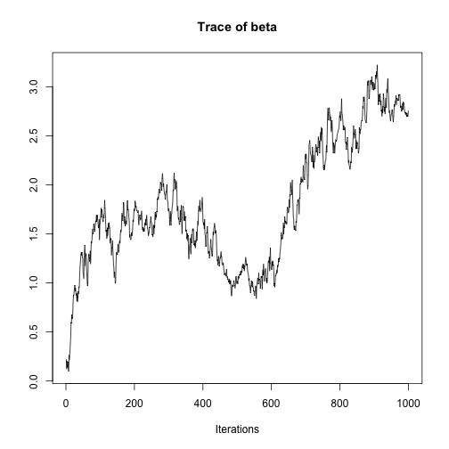
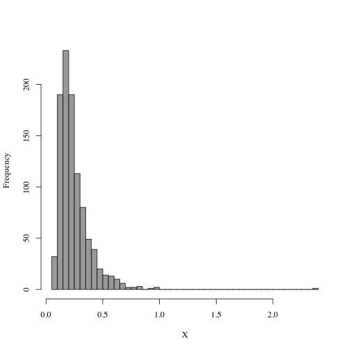
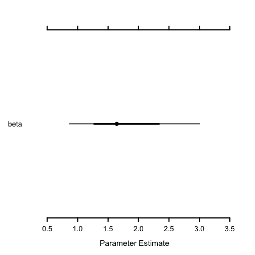

# Data analysis and statistical modeling

The following few sections introduce packages I frequently use for data analysis, modelling and machine learning.

## Stan

`Stan` is a great package for Bayesian modelling and inference. Compared to statistical packages that are fit to one model, such as `glmnet` or `lme4`, Stan allows to easily define custom Bayesian models for which posterior distributions are automatically inferred using HMC. 

A simple liner regression model could look like this:

```r
library(rstan)
```

```
## Loading required package: ggplot2
```

```
## Loading required package: StanHeaders
```

```
## rstan (Version 2.18.2, GitRev: 2e1f913d3ca3)
```

```
## For execution on a local, multicore CPU with excess RAM we recommend calling
## options(mc.cores = parallel::detectCores()).
## To avoid recompilation of unchanged Stan programs, we recommend calling
## rstan_options(auto_write = TRUE)
```

```r
library(lme4)

model <- "
data {
  int<lower=1> n;
  vector[n] x;
  vector[n] y;
}

parameters {
  real beta;
  real<lower=0> sigma;
  real alpha;
}

model {
  beta ~ normal(0, 5);
  sigma ~ cauchy(0, 5);
  y ~ normal(alpha + x * beta, sigma);
}
"

n <- nrow(sleepstudy)
x <- sleepstudy$Days
y <- sleepstudy$Reaction

fit <- stan(model_code=model, data=list(n=n, x=x, y=y), warmup=100, iter=1100, chains=1)
```

```
## 
## SAMPLING FOR MODEL '920bbd45e873f3162b84171e9f3ae19f' NOW (CHAIN 1).
## Chain 1: 
## Chain 1: Gradient evaluation took 3.9e-05 seconds
## Chain 1: 1000 transitions using 10 leapfrog steps per transition would take 0.39 seconds.
## Chain 1: Adjust your expectations accordingly!
## Chain 1: 
## Chain 1: 
## Chain 1: WARNING: There aren't enough warmup iterations to fit the
## Chain 1:          three stages of adaptation as currently configured.
## Chain 1:          Reducing each adaptation stage to 15%/75%/10% of
## Chain 1:          the given number of warmup iterations:
## Chain 1:            init_buffer = 15
## Chain 1:            adapt_window = 75
## Chain 1:            term_buffer = 10
## Chain 1: 
## Chain 1: Iteration:    1 / 1100 [  0%]  (Warmup)
## Chain 1: Iteration:  101 / 1100 [  9%]  (Sampling)
## Chain 1: Iteration:  210 / 1100 [ 19%]  (Sampling)
## Chain 1: Iteration:  320 / 1100 [ 29%]  (Sampling)
## Chain 1: Iteration:  430 / 1100 [ 39%]  (Sampling)
## Chain 1: Iteration:  540 / 1100 [ 49%]  (Sampling)
## Chain 1: Iteration:  650 / 1100 [ 59%]  (Sampling)
## Chain 1: Iteration:  760 / 1100 [ 69%]  (Sampling)
## Chain 1: Iteration:  870 / 1100 [ 79%]  (Sampling)
## Chain 1: Iteration:  980 / 1100 [ 89%]  (Sampling)
## Chain 1: Iteration: 1090 / 1100 [ 99%]  (Sampling)
## Chain 1: Iteration: 1100 / 1100 [100%]  (Sampling)
## Chain 1: 
## Chain 1:  Elapsed Time: 0.09321 seconds (Warm-up)
## Chain 1:                1.24535 seconds (Sampling)
## Chain 1:                1.33856 seconds (Total)
## Chain 1:
```

```r
summary(fit)
```

```
## $summary
##              mean    se_mean       sd        2.5%         25%         50%
## beta     9.868392 0.09806106 1.385135    7.223284    8.919014    9.872692
## sigma   47.894383 0.08307353 2.667212   43.077054   46.125307   47.712120
## alpha  254.298044 0.62450039 7.624112  238.836541  249.236807  254.934744
## lp__  -789.255880 0.11645044 1.473480 -792.855374 -789.909002 -788.930402
##              75%      97.5%     n_eff      Rhat
## beta    10.78288   12.59845  199.5223 0.9994681
## sigma   49.66418   53.36189 1030.8366 0.9992917
## alpha  259.52014  267.87282  149.0435 1.0028296
## lp__  -788.15637 -787.60327  160.1054 1.0069455
## 
## $c_summary
## , , chains = chain:1
## 
##          stats
## parameter        mean       sd        2.5%         25%         50%
##     beta     9.868392 1.385135    7.223284    8.919014    9.872692
##     sigma   47.894383 2.667212   43.077054   46.125307   47.712120
##     alpha  254.298044 7.624112  238.836541  249.236807  254.934744
##     lp__  -789.255880 1.473480 -792.855374 -789.909002 -788.930402
##          stats
## parameter        75%      97.5%
##     beta    10.78288   12.59845
##     sigma   49.66418   53.36189
##     alpha  259.52014  267.87282
##     lp__  -788.15637 -787.60327
```

### Rstanarm

`rstanarm` is a package for applied Bayesian modelling that wraps around Stan for easier usage. 


```r
library(rstanarm)
```

```
## Loading required package: Rcpp
```

```
## rstanarm (Version 2.17.4, packaged: 2018-04-13 01:51:52 UTC)
```

```
## - Do not expect the default priors to remain the same in future rstanarm versions.
```

```
## Thus, R scripts should specify priors explicitly, even if they are just the defaults.
```

```
## - For execution on a local, multicore CPU with excess RAM we recommend calling
```

```
## options(mc.cores = parallel::detectCores())
```

```
## - Plotting theme set to bayesplot::theme_default().
```

```
## 
## Attaching package: 'rstanarm'
```

```
## The following object is masked from 'package:rstan':
## 
##     loo
```

```
## The following objects are masked from 'package:greta':
## 
##     cauchy, dirichlet, exponential, laplace, normal
```

```r
fit <- rstanarm::stan_glm(Reaction ~ Days, sleepstudy, chains = 1,
                          iter = 1100, warmup = 100, family = gaussian())
```

```
## 
## SAMPLING FOR MODEL 'continuous' NOW (CHAIN 1).
## 
## Gradient evaluation took 0.000138 seconds
## 1000 transitions using 10 leapfrog steps per transition would take 1.38 seconds.
## Adjust your expectations accordingly!
## 
## 
## WARNING: There aren't enough warmup iterations to fit the
##          three stages of adaptation as currently configured.
##          Reducing each adaptation stage to 15%/75%/10% of
##          the given number of warmup iterations:
##            init_buffer = 15
##            adapt_window = 75
##            term_buffer = 10
## 
## Iteration:    1 / 1100 [  0%]  (Warmup)
## Iteration:  101 / 1100 [  9%]  (Sampling)
## Iteration:  210 / 1100 [ 19%]  (Sampling)
## Iteration:  320 / 1100 [ 29%]  (Sampling)
## Iteration:  430 / 1100 [ 39%]  (Sampling)
## Iteration:  540 / 1100 [ 49%]  (Sampling)
## Iteration:  650 / 1100 [ 59%]  (Sampling)
## Iteration:  760 / 1100 [ 69%]  (Sampling)
## Iteration:  870 / 1100 [ 79%]  (Sampling)
## Iteration:  980 / 1100 [ 89%]  (Sampling)
## Iteration: 1090 / 1100 [ 99%]  (Sampling)
## Iteration: 1100 / 1100 [100%]  (Sampling)
## 
##  Elapsed Time: 0.080798 seconds (Warm-up)
##                1.66231 seconds (Sampling)
##                1.74311 seconds (Total)
```

```
## Warning: There were 1 chains where the estimated Bayesian Fraction of Missing Information was low. See
## http://mc-stan.org/misc/warnings.html#bfmi-low
```

```
## Warning: Examine the pairs() plot to diagnose sampling problems
```

```r
summary(fit)
```

```
## 
## Model Info:
## 
##  function:     stan_glm
##  family:       gaussian [identity]
##  formula:      Reaction ~ Days
##  algorithm:    sampling
##  priors:       see help('prior_summary')
##  sample:       1000 (posterior sample size)
##  observations: 180
##  predictors:   2
## 
## Estimates:
##                 mean    sd      2.5%    25%     50%     75%     97.5%
## (Intercept)     256.4    21.9   238.3   247.2   252.1   257.5   346.3
## Days             10.4     1.4     7.8     9.5    10.3    11.3    13.0
## sigma            50.8    13.0    43.5    46.5    48.1    50.0   104.1
## mean_PPD        303.0    21.2   288.5   295.0   298.7   302.6   391.7
## log-posterior  -967.9    30.8 -1102.3  -961.9  -960.8  -960.2  -959.6
## 
## Diagnostics:
##               mcse Rhat n_eff
## (Intercept)   4.6  1.0    23 
## Days          0.0  1.0  1050 
## sigma         2.7  1.0    23 
## mean_PPD      4.6  1.1    21 
## log-posterior 6.7  1.1    21 
## 
## For each parameter, mcse is Monte Carlo standard error, n_eff is a crude measure of effective sample size, and Rhat is the potential scale reduction factor on split chains (at convergence Rhat=1).
```

### brms

For non-linear multi-level models `brms` is also a great option. 


```r
library(brms)
```

```
## Warning: replacing previous import 'rstan::loo' by 'loo::loo' when loading
## 'brms'
```

```
## Loading 'brms' package (version 2.3.1). Useful instructions
## can be found by typing help('brms'). A more detailed introduction
## to the package is available through vignette('brms_overview').
## Run theme_set(theme_default()) to use the default bayesplot theme.
```

```
## 
## Attaching package: 'brms'
```

```
## The following objects are masked from 'package:rstanarm':
## 
##     exponential, kfold, lasso, ngrps
```

```
## The following object is masked from 'package:rstan':
## 
##     loo
```

```
## The following object is masked from 'package:lme4':
## 
##     ngrps
```

```
## The following objects are masked from 'package:greta':
## 
##     bernoulli, categorical, exponential, lognormal, mixture,
##     student, weibull
```

```r
fit.multilevel <- brm(Reaction ~ Days + (Days | Subject), sleepstudy, chains=1, iter=1000)
```

```
## Compiling the C++ model
```

```
## Start sampling
```

```
## 
## SAMPLING FOR MODEL 'gaussian brms-model' NOW (CHAIN 1).
## Chain 1: 
## Chain 1: Gradient evaluation took 0.000105 seconds
## Chain 1: 1000 transitions using 10 leapfrog steps per transition would take 1.05 seconds.
## Chain 1: Adjust your expectations accordingly!
## Chain 1: 
## Chain 1: 
## Chain 1: Iteration:   1 / 1000 [  0%]  (Warmup)
## Chain 1: Iteration: 100 / 1000 [ 10%]  (Warmup)
## Chain 1: Iteration: 200 / 1000 [ 20%]  (Warmup)
## Chain 1: Iteration: 300 / 1000 [ 30%]  (Warmup)
## Chain 1: Iteration: 400 / 1000 [ 40%]  (Warmup)
## Chain 1: Iteration: 500 / 1000 [ 50%]  (Warmup)
## Chain 1: Iteration: 501 / 1000 [ 50%]  (Sampling)
## Chain 1: Iteration: 600 / 1000 [ 60%]  (Sampling)
## Chain 1: Iteration: 700 / 1000 [ 70%]  (Sampling)
## Chain 1: Iteration: 800 / 1000 [ 80%]  (Sampling)
## Chain 1: Iteration: 900 / 1000 [ 90%]  (Sampling)
## Chain 1: Iteration: 1000 / 1000 [100%]  (Sampling)
## Chain 1: 
## Chain 1:  Elapsed Time: 1.82187 seconds (Warm-up)
## Chain 1:                0.515526 seconds (Sampling)
## Chain 1:                2.33739 seconds (Total)
## Chain 1:
```

```r
summary(fit.multilevel)
```

```
##  Family: gaussian 
##   Links: mu = identity; sigma = identity 
## Formula: Reaction ~ Days + (Days | Subject) 
##    Data: sleepstudy (Number of observations: 180) 
## Samples: 1 chains, each with iter = 1000; warmup = 500; thin = 1;
##          total post-warmup samples = 500
## 
## Group-Level Effects: 
## ~Subject (Number of levels: 18) 
##                     Estimate Est.Error l-95% CI u-95% CI Eff.Sample Rhat
## sd(Intercept)          26.97      6.64    16.91    41.94        251 1.00
## sd(Days)                6.54      1.44     4.16     9.63        214 1.00
## cor(Intercept,Days)     0.09      0.27    -0.40     0.64        156 1.00
## 
## Population-Level Effects: 
##           Estimate Est.Error l-95% CI u-95% CI Eff.Sample Rhat
## Intercept   251.68      7.09   238.40   266.13        123 1.00
## Days         10.38      1.65     7.05    13.53        172 1.00
## 
## Family Specific Parameters: 
##       Estimate Est.Error l-95% CI u-95% CI Eff.Sample Rhat
## sigma    25.91      1.50    23.36    29.04        474 1.00
## 
## Samples were drawn using sampling(NUTS). For each parameter, Eff.Sample 
## is a crude measure of effective sample size, and Rhat is the potential 
## scale reduction factor on split chains (at convergence, Rhat = 1).
```

### bayesplot

For plotting of Bayesian models inferred using the tools mentioned above, you probably want to use `bayesplot`. For instance, to compare posterior predictive intervals between the `rstanarm` linear model and the mixed model form `brms`:


```r
library(bayesplot)
```

```
## This is bayesplot version 1.5.0
```

```
## - Plotting theme set to bayesplot::theme_default()
```

```
## - Online documentation at mc-stan.org/bayesplot
```

```r
library(cowplot)
```

```
## 
## 
## *******************************************************
```

```
## Note: cowplot does not change the default ggplot2 theme
```

```
## anymore. To recover the previous behavior, execute:
##   theme_set(theme_cowplot())
```

```
## *******************************************************
```

```r
p1 <- ppc_intervals(y = sleepstudy$Reaction,
              yrep = posterior_predict(fit)) +
  labs(title="Linear model")
p2 <- ppc_intervals(y = sleepstudy$Reaction,
                    yrep = posterior_predict(fit.multilevel)) +
  labs(title="Linear mixed model")

cowplot::plot_grid(p1, p2, ncol=2, align="h")
```


## greta

Model definitions in Stan are arguable difficult in the beginning. As an alternative with `greta` is not only easier to compose models, but also often faster owing to the fact that it's developed against tensorflow. Installation can be a bit tedious. For `greta` version `v.0.3` I would install tensorflow from the command line:


```bash
conda create -y -n r-tensorflow python=3.6
conda install tensorflow==1.10.0
pip install tensorflow-probability==0.30.0
```

The same model we used for stan above, looks like this with greta:


```r
library(greta)
library(lme4)

n <- nrow(sleepstudy)
x <- sleepstudy$Days
y <- sleepstudy$Reaction

alpha <- variable()
beta <- greta::normal(0, 5)
sigma <- greta::cauchy(0, 5, truncation=c(0, Inf))

y <- greta::as_data(y)
greta::distribution(y) <- greta::normal(alpha + x * beta, sigma)

mod <- greta::model(beta)
samples <- greta::mcmc(mod, n_samples=1000, warmup=100, chains=1)
```

```
## 
    warmup                                            0/100 | eta:  ?s          
    warmup ===================                       50/100 | eta:  1s | 84% bad
    warmup ======================================   100/100 | eta:  0s | 42% bad
## 
  sampling                                           0/1000 | eta:  ?s          
  sampling ==                                       50/1000 | eta:  9s          
  sampling ====                                    100/1000 | eta:  9s          
  sampling ======                                  150/1000 | eta:  8s          
  sampling ========                                200/1000 | eta:  8s          
  sampling ==========                              250/1000 | eta:  7s          
  sampling ===========                             300/1000 | eta:  6s          
  sampling =============                           350/1000 | eta:  5s          
  sampling ===============                         400/1000 | eta:  5s          
  sampling =================                       450/1000 | eta:  5s          
  sampling ===================                     500/1000 | eta:  4s          
  sampling =====================                   550/1000 | eta:  4s          
  sampling =======================                 600/1000 | eta:  3s          
  sampling =========================               650/1000 | eta:  3s          
  sampling ===========================             700/1000 | eta:  2s          
  sampling ============================            750/1000 | eta:  2s          
  sampling ==============================          800/1000 | eta:  2s          
  sampling ================================        850/1000 | eta:  1s          
  sampling ==================================      900/1000 | eta:  1s          
  sampling ====================================    950/1000 | eta:  0s          
  sampling ====================================== 1000/1000 | eta:  0s
```

```r
summary(samples)
```

```
## 
## Iterations = 1:1000
## Thinning interval = 1 
## Number of chains = 1 
## Sample size per chain = 1000 
## 
## 1. Empirical mean and standard deviation for each variable,
##    plus standard error of the mean:
## 
##           Mean             SD       Naive SE Time-series SE 
##        1.77781        0.65008        0.02056        0.29951 
## 
## 2. Quantiles for each variable:
## 
##   2.5%    25%    50%    75%  97.5% 
## 0.8666 1.2706 1.6429 2.3362 3.0039
```

## MCMC

There are a couple of packages on CRAN especially for Markov Chain Monte Carlo and Bayesian methods, some of which are mentioned below.

`coda` is a package for analysis and diagnostics of MCMC chains. Mostly it takes arguments of class mcmc.list, so put your results into an object of it to be able to use `coda`:

```r
library(coda)
```

```
## 
## Attaching package: 'coda'
```

```
## The following object is masked from 'package:rstan':
## 
##     traceplot
```

```
## The following object is masked from 'package:greta':
## 
##     mcmc
```

```r
coda::autocorr(samples)
```

```
## $`1`
## , , beta
## 
##             beta
## Lag 0  1.0000000
## Lag 1  0.9906131
## Lag 5  0.9548969
## Lag 10 0.9140411
## Lag 50 0.7188161
```

```r
coda::traceplot(samples)
```



`MCMCpack` offer an alternative to rstanarm for applied Bayesian modelling. It also comes with a set of useful distributions used frequently in Bayesian modelling, such as the Dirichlet, inverse gamma, etc. 


```r
library(MCMCpack)
```

```
## Loading required package: MASS
```

```
## ##
## ## Markov Chain Monte Carlo Package (MCMCpack)
```

```
## ## Copyright (C) 2003-2018 Andrew D. Martin, Kevin M. Quinn, and Jong Hee Park
```

```
## ##
## ## Support provided by the U.S. National Science Foundation
```

```
## ## (Grants SES-0350646 and SES-0350613)
## ##
```

```r
invg <- MCMCpack::rinvgamma(1000, 5, 1)
hist(invg, breaks=50, xlab="X", main="", col="darkgrey", family="serif")
```



For plotting `mcmc.list` objects (from `coda`) `MCMCvis` is great:


```r
MCMCvis::MCMCplot(samples)
```



## mlR and openML

CRAN offers dozens of packages related to machine and statistical learning, many of which doing the same. `mlR` wraps many of these into one big library.
`mlR` integrates with `openML`, an open machine learning platform where people share code, data and algorithms. Here we show an example where we use a Gaussian process to predict the Kyphosis label from the `gam` package.


```r
library(mlr)
```

```
## Loading required package: ParamHelpers
```

```
## 
## Attaching package: 'mlr'
```

```
## The following object is masked from 'package:tensorflow':
## 
##     train
```

```r
task  <- mlr::makeClassifTask(data = kyphosis, target = "Kyphosis")
```

```
## Error in .Call(c_check_dataframe, x, any.missing, all.missing, min.rows, : object 'kyphosis' not found
```

```r
lrn   <- mlr::makeLearner("classif.gausspr")

n <- nrow(kyphosis)
```

```
## Error in nrow(kyphosis): object 'kyphosis' not found
```

```r
train.set <- sample(n, size = 2/3*n)
test.set  <- setdiff(1:n, train.set)

model <- mlr::train(lrn, task, subset = train.set)
```

```
## Error in checkClass(x, classes, ordered, null.ok): object 'task' not found
```

```r
pred  <- stats::predict(model, task = task, subset = test.set)
```

```
## Error in UseMethod("predict"): no applicable method for 'predict' applied to an object of class "character"
```

```r
performance(pred, measures = list(mmce, acc))
```

```
## Error in performance(pred, measures = list(mmce, acc)): object 'pred' not found
```

## Tensorflow

Thanks to Rstudio, R users are able to use `tensorflow`, a library for high performance numerical computations (which for instance greta uses). For instance, a linear model could look like this:


```r
library(tensorflow)

n <- nrow(sleepstudy)
x <- sleepstudy$Days
y <- sleepstudy$Reaction

# define model
beta  <- tf$Variable(tf$random_normal(shape(1L), 0, 10))
alpha <- tf$Variable(tf$zeros(shape(1L)))
y.hat <- alpha + beta * x

# Minimize the mean squared errors.
loss <- tf$reduce_mean((y - y.hat) ^ 2)
optimizer <- tf$train$GradientDescentOptimizer(.5)
train <- optimizer$minimize(loss)

# Launch the graph and initialize the variables.
sess <- tf$Session()
sess$run(tf$global_variables_initializer())

for (step in 1:100)
{
  sess$run(train)
}
cat(step, "-", sess$run(alpha), sess$run(beta), "\n")
```

```
## 100 - NaN NaN
```

## Keras

`Keras` is an interface to popular numerical libraries such as tensorflow and theano for which model/network definitions are independent of the library on the backend.
Our tensorflow model from above would look the following in keras:


```r
library(keras)

model <- keras_model_sequential() %>%
  layer_dense(units = 1, activation = "linear", input_shape = 1)
model %>%
  compile(loss = "mse",
          optimizer = optimizer_sgd(0.5),
          metrics = list("mean_absolute_error"))

summary(model)
```

```
## ___________________________________________________________________________
## Layer (type)                     Output Shape                  Param #     
## ===========================================================================
## dense_2 (Dense)                  (None, 1)                     2           
## ===========================================================================
## Total params: 2
## Trainable params: 2
## Non-trainable params: 0
## ___________________________________________________________________________
```

## Regression models and machine learning

Some packages for regression:

* `glmnet` for $\ell_1$- and $\ell_2$-penalized linear regression models,
* `lme4` for frequentist mixed models,
* `mgcv` for generalized additive models,
* `netReg` for graph regularized linear models,
* `xgboost` and `gbm` for boosting.
* `h20` for general machine learning algorithms,

## Big data analytics

For Big data analytics I recommend Rstudio's `sparklyr` since it nicelt itegrates with the other methods from the `tidyverse`. For instance, following an example from [Rstudio's tutorials](https://spark.rstudio.com/mlib/):


```r
library(sparklyr)

sc <- spark_connect(master = "local")
kmeans_model <- copy_to(sc, iris, "iris", overwrite = TRUE) %>%
  select(Petal_Width, Petal_Length) %>%
  ml_kmeans(centers = 3)git add -A
```

## Others

Some other great packages for various data-related things:

### modelr

`modelr` defines multiple helper functions related to statistical modelling:


```r
library(modelr)
```

```
## 
## Attaching package: 'modelr'
```

```
## The following object is masked from 'package:mlr':
## 
##     resample
```

```r
sleepstudy %>% modelr::fit_with(
  lm, 
  modelr::formulas(~Reaction,
                   no_intercept = ~0 + Days, 
                   intercept = ~1 + Days))
```

```
## $no_intercept
## 
## Call:
## .f(formula = Reaction ~ 0 + Days, data = data)
## 
## Coefficients:
##  Days  
## 50.16  
## 
## 
## $intercept
## 
## Call:
## .f(formula = Reaction ~ 1 + Days, data = data)
## 
## Coefficients:
## (Intercept)         Days  
##      251.41        10.47
```

### kernlab

Use `kernlab` for tasks related to kernels, such as Gaussian process regression or merely computing a Gram-matrix.


```r
library(kernlab)
```

```
## 
## Attaching package: 'kernlab'
```

```
## The following object is masked from 'package:coda':
## 
##     nvar
```

```
## The following object is masked from 'package:brms':
## 
##     prior
```

```
## The following object is masked from 'package:ggplot2':
## 
##     alpha
```

```r
x <- matrix(rnorm(25), 5)
rbf <- kernlab::rbfdot()
(K <- kernlab::kernelMatrix(rbf, x))
```

```
## An object of class "kernelMatrix"
##              [,1]        [,2]         [,3]         [,4]         [,5]
## [1,] 1.000000e+00 0.000197961 2.208150e-06 1.388817e-06 0.0002691531
## [2,] 1.979610e-04 1.000000000 1.822312e-01 2.132280e-02 0.4780560424
## [3,] 2.208150e-06 0.182231197 1.000000e+00 1.866598e-03 0.0484058496
## [4,] 1.388817e-06 0.021322797 1.866598e-03 1.000000e+00 0.0028235407
## [5,] 2.691531e-04 0.478056042 4.840585e-02 2.823541e-03 1.0000000000
```

```r
x <- sort(rnorm(100))
y <- 3 + 0.5 * x^2 + 1 * x + rnorm(100, 0, 0.05)
gpr <- kernlab::gausspr(x, y)
```

```
## Using automatic sigma estimation (sigest) for RBF or laplace kernel
```

```r
plot(x, y, family="serif", a)
```

```
## Error in plot.xy(xy, type, ...): object 'a' not found
```

```r
lines(x, predict(gpr, x), col="red")
```


